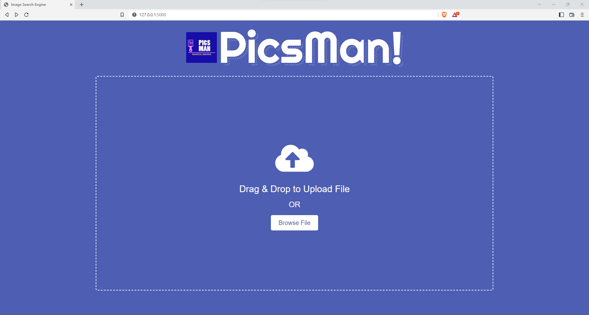
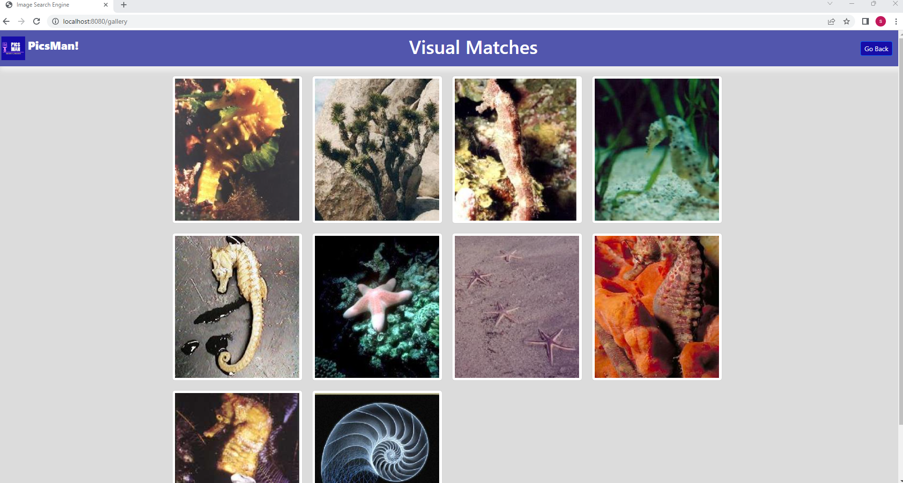

# Prediction Endpoint
This project is designed to develop a sophisticated reverse image search engine capable of retrieving similar or related images from vast web sources in response to an input image. This endeavor uses the advanced technology of computer vision - a significant subfield of artificial intelligence, to interpret and extract valuable data from digital images. 

Our project is split into two distinct parts, each with a separate repository. The data collection repository, **Embedding Based Image Search Engine** ([link](https://github.com/SiddharthUchil/image-search-data-collection)), is designed for image data ingestion. This is the bedrock of the project, capturing and cataloguing a diverse range of images that our search engine will later reference. 

The second part of the project is encapsulated in a separate repository, named as **ModelTrainer** ([link](https://github.com/SiddharthUchil/image-search-model-trainer)). This repository focuses on the critical process of model training. Utilizing the power of the Paperspace GPU Instance with a high configuration, we have structured a continuous training pipeline that enhances the efficacy of our image search engine. However, to control costs, this instance is kept in an off state by default. To use the training endpoint, you need to manually trigger the workflow to initiate the training process.

Following the success of these two modules, our reverse image search engine will be capable of sophisticated image matching and retrieval, representing the combined efforts of advanced machine learning technologies and a highly refined dataset. Both repositories interrelate, symbolizing the intricate development process that ultimately results in a high-performing reverse image search engine. Developers are encouraged to explore both repositories, gaining insight into the process of data collection and the implementation of a highly accurate model training workflow.

## Architectures 


## User Interface



## Infrastructure Needed
1. GitHub Actions
2. Elastic Container Registry
3. S3 Bucket and Mongo
4. Elastic Cloud Compute

## Project Setup

Get Aws Access Creds and update in Secrets.
```bash
export AWS_ACCESS_KEY_ID=<access-key>
export AWS_SECRET_ACCESS_KEY=<secret-key>
export AWS_REGION=<aws-region>

export AWS_BUCKET_NAME=<bucket-name>

export AWS_ECR_LOGIN_URI=<ecr-login-uri>
export ECR_REPOSITORY_NAME=<ecr-repository-name>
```
